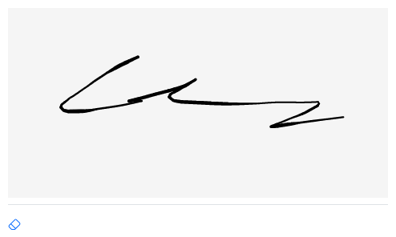

# Django Signature Pad

A Django field for capturing signatures using [szimek signature_pad](https://github.com/szimek/signature_pad).

By design, signatures are stored as PNG images encoded as data URLs. This means:

- Signatures can only be displayed as images after being saved
- Signatures cannot be loaded back into the signature pad for editing
- To modify a signature, users must draw a new one from scratch
- This design decision was made to ensure signature integrity and simplify storage requirements.



⚠️ **Important Note**: This package does not include the `signature_pad` JavaScript library. You need to install it separately following the instructions on [GitHub](https://github.com/szimek/signature_pad/).

📦 Common installation methods include:

- Using npm: `npm install signature_pad`
- Using a CDN: `<script src="https://cdn.jsdelivr.net/npm/signature_pad@5.0.4/dist/signature_pad.umd.min.js"></script>`
- Downloading directly from [GitHub releases](https://github.com/szimek/signature_pad/releases)

## Security Features

The SignaturePadField includes several security features:

- Data URL format validation
- Base64 encoding verification
- PNG signature verification
- Size limitation (default: 100KB)

These safeguards help protect against malicious input and ensure data integrity.

## Installation

```bash
pip install django-signature-pad
```

## Quick Start

1. Add "signature_pad" to your INSTALLED_APPS:

```python
INSTALLED_APPS = [
    ...
    'signature_pad',
]
```

2. Use the field in your models:

```python
from django.db import models
from signature_pad import SignaturePadField

class Document(models.Model):
    signature = SignaturePadField(blank=True, null=True)
```

3. Create a form for your model:

```python
from django import forms
from .models import Document

class DocumentForm(forms.ModelForm):
    class Meta:
        model = Document
        fields = ['signature']  # Include other fields as needed
```

4. Use the form in your template:

```html
{{ form.media }}
<form method="post">
   {{ form.as_p }}
  <button type="submit">Save</button>
</form>
```

5. Render signature image:

```html

```

Widget customization (optional):

```python
from django import forms
from signature_pad import SignaturePadWidget
from .models import Document

class DocumentForm(forms.ModelForm):
    signature = forms.CharField(
        widget=SignaturePadWidget(
            dotSize=2.5,
            minWidth=1.0,
            maxWidth=4.0,
            backgroundColor="rgb(240, 240, 240)",
            penColor="rgb(0, 0, 255)"
        )
    )

    class Meta:
        model = Document
        fields = ["name", "signature"]
```

Available customization options:

    dotSize: Size of the drawing dot (float)
    minWidth: Minimum width of the signature line (float)
    maxWidth: Maximum width of the signature line (float)
    backgroundColor: Canvas background color (CSS color string)
    penColor: Signature line color (CSS color string)

## Example Project

Want to see it in action? Try the example project:

```bash
# Clone the repository
git clone https://github.com/hleroy/django-signature-pad.git
cd django-signature-pad

# Create and activate virtual environment
python -m venv venv
source venv/bin/activate

# Install Django and django-signature-pad package
pip install Django
pip install -e .

# Setup the example project
cd example_project
python manage.py migrate
python manage.py createsuperuser
```

Fill in the superuser information when prompted. Then start the development server:

```bash
python manage.py runserver
```

Visit [http://127.0.0.1:8000/](http://127.0.0.1:8000/) to see the demo in action. You can also access the [admin interface](http://127.0.0.1:8000/admin) using the credentials you just created.

## License

This project is licensed under the MIT License - see the LICENSE file for details.
